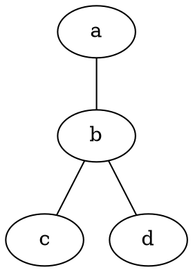
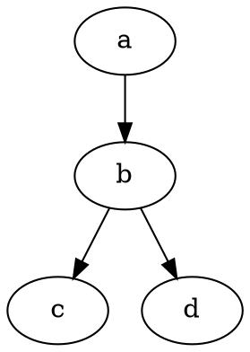

# Trabalho de Grafos - DIM0549

Trabalho da disciplina de Grafos (DIM0549) - Engenharia de Software UFRN.

Implementação dos algoritmos BFS e DFS conforme solicitado.

## O que tem aqui

### 1. BFS (Busca em Largura)
- Implementado com **matriz de adjacência** 
- Fonte: vértice com menor ordem lexicográfica (sempre o 'a' primeiro)
- Segue ordem lexicográfica pra processar
- Mostra ordem de visitação e árvore de predecessores

### 2. DFS (Busca em Profundidade) 
- Implementado com **lista de adjacência**
- Fonte: vértice com menor ordem lexicográfica
- Processa o grafo inteiro (floresta DFS)
- Segue ordem lexicográfica
- Mostra ordem de visitação, predecessores e **tempos de início/fim**

## Como usar

Instalar dependências:
```bash
pip install -r requirements.txt
```

Executar:
```bash
python reader.py arquivo.dot
```

## Arquivos do projeto

- **`reader.py`** - código principal com BFS e DFS
- **`requirements.txt`** - dependências necessárias  
- **`graph.dot`** - exemplo grafo não direcionado
- **`di_grafo.gv`** - exemplo grafo direcionado  
- **`grafo_floresta.dot`** - exemplo com componentes desconectadas

## Exemplo de execução

```bash
python reader.py graph.dot
```

Saída:
- Informações do grafo (tipo, vértices, arestas)
- Matriz de adjacência (para BFS)
- Resultados BFS (ordem + predecessores)
- Lista de adjacência (para DFS)
- Resultados DFS (ordem + predecessores + tempos)

## Formato de entrada

Lê arquivos DOT (.dot ou .gv):

**Grafo não direcionado:**


**Grafo direcionado:**
